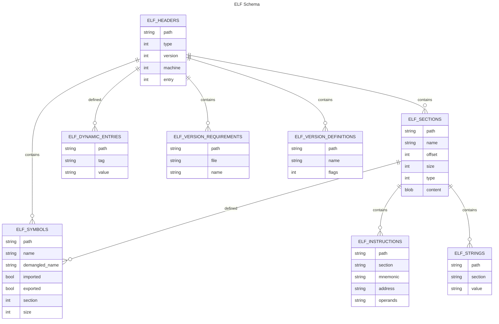

# sqlelf

[](https://pypi.org/project/sqlelf)
[](https://pypi.org/project/sqlelf)


> Explore ELF objects through the power of SQL

A tool that utilizes SQLite's virtual table functionality to allow you to explore Linux ELF objects through SQL.

Traditionally exploring an ELF file was limited to tools such as `objdump` or `readelf`. While these tools are full featured in their parsing capability, the output format and ability to ask exploratory questions is limited.

`SQL` is the _lingua franca_ for asking questions in a declarative manner.
Let's enhance our ability to introspect binaries!



## Installation

```console
❯ pip install sqlelf
❯ sqlelf /usr/bin/python3 -- \
--sql "select mnemonic, COUNT(*) from elf_instructions GROUP BY mnemonic ORDER BY 2 DESC LIMIT 3"

mov|223497
call|56209
jmp|48213
```

### Nix

You can also run this via [Nix](https://nixos.org/)!
```console
❯ nix run github:fzakaria/sqlelf -- --help
usage: sqlelf [-h] [-s SQL] [--recursive | --no-recursive] [--cache-flag CACHE_FLAG] FILE [FILE ...]
```

## Usage

```console
❯ sqlelf --help
usage: sqlelf [-h] FILE [FILE ...]

Analyze ELF files with the power of SQL

positional arguments:
  FILE        The ELF file to analyze

options:
  -h, --help            show this help message and exit
  -s SQL, --sql SQL     Potential SQL to execute. Omitting this enters the REPL.
  --recursive, --no-recursive
                        Load all shared libraries needed by each file using ldd
```

Note: You may provide directories for `FILE`. Avoid giving too many binaries though since they must all be parsed at startup.

## Tour

You simply have to fire up `sqlelf` and give it a list of binaries or directories and start exploring ELF via SQL.

Simple demo showing a simple `SELECT` :

```console
❯ sqlelf /usr/bin/ruby --sql "select * from elf_headers"
/usr/bin/ruby|DYNAMIC|x86_64|CURRENT|4400
```

```console
❯ sqlelf /usr/bin/ruby /bin/ls
SQLite version 3.40.1 (APSW 3.40.0.0)
Enter ".help" for instructions
Enter SQL statements terminated with a ";"
sqlite> .header ON
sqlite> select * from elf_headers;
path|type|machine|version|entry
/usr/bin/ruby|3|62|1|4400
/bin/ls|3|62|1|25040
```

A more intricate demo showing an `INNER JOIN`, `WHERE` and `GROUP BY` across two tables which each represent different portions of the ELF format.

```console
SQLite version 3.40.1 (APSW 3.40.0.0)
Enter ".help" for instructions
Enter SQL statements terminated with a ";"
sqlite> .header ON
sqlite> SELECT elf_headers.path, COUNT(*) as num_sections
    ..> FROM elf_headers
    ..> INNER JOIN elf_sections ON elf_headers.path = elf_sections.path
    ..> WHERE elf_headers.type = 3
    ..> GROUP BY elf_headers.path;
path|num_sections
/bin/ls|31
/usr/bin/pnmarith|27
/usr/bin/ruby|28
```

You can provide _multiple SQL_ statements to the CLI. This is useful if you want to invoke many of the special _dot_ commands. You can use `.help` to see the list of possible commands or refer to the [apsw shell documentation](https://rogerbinns.github.io/apsw/shell.html).

For instance, to have _sqelf_ emit JSON you can do the following:

```console
❯ sqlelf /usr/bin/ruby --sql ".mode json" --sql "select path,name from elf_sections LIMIT 3;"
{ "path": "\/usr\/bin\/ruby", "name": ""},
{ "path": "\/usr\/bin\/ruby", "name": ".interp"},
{ "path": "\/usr\/bin\/ruby", "name": ".note.gnu.property"},
```

`sqlelf` will store the data from the ELF file into in-memory SQLite database. This allows you to run multiple queries against the same file(s) without having to reparse them and is much more efficient than iterating the ELF structures. This comes at the cost of startup time.

You can however _dump_ the sqlite database to a file on disk and then load it back up later. This is useful if you want to run many queries against the same file(s) and don't want to pay the startup cost each time.

```console
❯ sqlelf /nix/store/gjr9ylm023rl9di484g1wxcd1jp84xxv-nix-2.8.1/bin/nix \
    --sql ".dump /tmp/nix.sqlite"
❯ file /tmp/nix-backup.sqlite
/tmp/nix-backup.sqlite: SQLite 3.x database, last written using SQLite version 3043001, writer version 2,
    read version 2, file counter 3, database pages 14069, cookie 0x2, schema 4, UTF-8, version-valid-for 3
```

### Queries

<details>
<summary>List all symbol resolutions (match import & export)</summary>

```console
❯ sqlelf /usr/bin/ruby --sql "SELECT caller.path as 'caller.path',
       callee.path as 'calee.path',
       caller.name,
       caller.demangled_name
FROM ELF_SYMBOLS caller
INNER JOIN ELF_SYMBOLS callee
ON
caller.name = callee.name AND
caller.path != callee.path AND
caller.imported = TRUE AND
callee.exported = TRUE
LIMIT 25;"
┌──────────────────────────────────────────┬──────────────────────────────────────────┬──────────────────────┬──────────────────────┐
│               caller.path                │                calee.path                │         name         │    demangled_name    │
│ /usr/bin/ruby                            │ /lib/x86_64-linux-gnu/libruby-3.1.so.3.1 │ ruby_run_node        │ ruby_run_node        │
│ /usr/bin/ruby                            │ /lib/x86_64-linux-gnu/libruby-3.1.so.3.1 │ ruby_init            │ ruby_init            │
│ /usr/bin/ruby                            │ /lib/x86_64-linux-gnu/libruby-3.1.so.3.1 │ ruby_options         │ ruby_options         │
│ /usr/bin/ruby                            │ /lib/x86_64-linux-gnu/libruby-3.1.so.3.1 │ ruby_sysinit         │ ruby_sysinit         │
│ /usr/bin/ruby                            │ /lib/x86_64-linux-gnu/libc.so.6          │ __stack_chk_fail     │ __stack_chk_fail     │
│ /usr/bin/ruby                            │ /lib/x86_64-linux-gnu/libruby-3.1.so.3.1 │ ruby_init_stack      │ ruby_init_stack      │
│ /usr/bin/ruby                            │ /lib/x86_64-linux-gnu/libc.so.6          │ setlocale            │ setlocale            │
│ /usr/bin/ruby                            │ /lib/x86_64-linux-gnu/libc.so.6          │ __libc_start_main    │ __libc_start_main    │
│ /usr/bin/ruby                            │ /lib/x86_64-linux-gnu/libc.so.6          │ __libc_start_main    │ __libc_start_main    │
│ /usr/bin/ruby                            │ /lib/x86_64-linux-gnu/libc.so.6          │ __cxa_finalize       │ __cxa_finalize       │
│ /lib/x86_64-linux-gnu/libruby-3.1.so.3.1 │ /lib/x86_64-linux-gnu/libc.so.6          │ initgroups           │ initgroups           │
│ /lib/x86_64-linux-gnu/libruby-3.1.so.3.1 │ /lib/x86_64-linux-gnu/libm.so.6          │ log10                │ log10                │
│ /lib/x86_64-linux-gnu/libruby-3.1.so.3.1 │ /lib/x86_64-linux-gnu/libc.so.6          │ chmod                │ chmod                │
│ /lib/x86_64-linux-gnu/libruby-3.1.so.3.1 │ /lib/x86_64-linux-gnu/libgmp.so.10       │ __gmpz_mul           │ __gmpz_mul           │
│ /lib/x86_64-linux-gnu/libruby-3.1.so.3.1 │ /lib/x86_64-linux-gnu/libm.so.6          │ lgamma_r             │ lgamma_r             │
│ /lib/x86_64-linux-gnu/libruby-3.1.so.3.1 │ /lib/x86_64-linux-gnu/libc.so.6          │ symlink              │ symlink              │
│ /lib/x86_64-linux-gnu/libruby-3.1.so.3.1 │ /lib/x86_64-linux-gnu/libc.so.6          │ mprotect             │ mprotect             │
│ /lib/x86_64-linux-gnu/libruby-3.1.so.3.1 │ /lib/x86_64-linux-gnu/libc.so.6          │ pipe2                │ pipe2                │
│ /lib/x86_64-linux-gnu/libruby-3.1.so.3.1 │ /lib/x86_64-linux-gnu/libc.so.6          │ seteuid              │ seteuid              │
│ /lib/x86_64-linux-gnu/libruby-3.1.so.3.1 │ /lib/x86_64-linux-gnu/libc.so.6          │ chdir                │ chdir                │
│ /lib/x86_64-linux-gnu/libruby-3.1.so.3.1 │ /lib/x86_64-linux-gnu/libc.so.6          │ fileno               │ fileno               │
│ /lib/x86_64-linux-gnu/libruby-3.1.so.3.1 │ /lib/x86_64-linux-gnu/libc.so.6          │ dup2                 │ dup2                 │
│ /lib/x86_64-linux-gnu/libruby-3.1.so.3.1 │ /lib/x86_64-linux-gnu/libc.so.6          │ pthread_cond_destroy │ pthread_cond_destroy │
│ /lib/x86_64-linux-gnu/libruby-3.1.so.3.1 │ /lib/x86_64-linux-gnu/libc.so.6          │ pthread_cond_destroy │ pthread_cond_destroy │
│ /lib/x86_64-linux-gnu/libruby-3.1.so.3.1 │ /lib/x86_64-linux-gnu/libm.so.6          │ atan2                │ atan2                │
└──────────────────────────────────────────┴──────────────────────────────────────────┴──────────────────────┴──────────────────────┘
```

</details>

<details>
<summary>Find symbols that are exported by more than one library</summary>

```console
❯ sqlelf ./examples/shadowed-symbols/exe --recursive --sql "
SELECT name, version, count(*) as symbol_count, GROUP_CONCAT(path, ':') as libraries
FROM elf_symbols
WHERE exported = TRUE
GROUP BY name, version
HAVING count(*) >= 2;"
┌──────┬────────┬───────────┬────────────────────────────────────────────────────────────────────────────────────────────────────────────────────────────────────────────────────────┐
│ name │ versio │ symbol_co │                                                                       libraries                                                                        │
│      │   n    │    unt    │                                                                                                                                                        │
├──────┼────────┼───────────┼────────────────────────────────────────────────────────────────────────────────────────────────────────────────────────────────────────────────────────┤
│ foo  │ NULL   │ 2         │ /usr/local/google/home/fmzakari/code/github.com/fzakaria/sqlelf/examples/shadowed-                                                                     │
│      │        │           │ symbols/x/libx.so:/usr/local/google/home/fmzakari/code/github.com/fzakaria/sqlelf/examples/shadowed-symbols/x/libx2.so                                 │
└──────┴────────┴───────────┴────────────────────────────────────────────────────────────────────────────────────────────────────────────────────────────────────────────────────────┘
```

</details>

<details>
<summary> List contained symbols, i.e. a symbol fully within the bounds of another</summary>

```console
sqlelf ./examples/nested-symbols/exe --sql "
SELECT outer_symbol.path, 
    outer_symbol.name AS outer_symbol_name, 
    inner_symbol.name AS inner_symbol_name
FROM 
    elf_symbols AS outer_symbol, 
    elf_symbols AS inner_symbol
WHERE
    inner_symbol.section = '.text' AND
    outer_symbol.section = '.text' AND
    inner_symbol.path = outer_symbol.path AND
    inner_symbol.value > outer_symbol.value AND
    (inner_symbol.value + inner_symbol.size) < (outer_symbol.value + outer_symbol.size) AND
    inner_symbol.name != outer_symbol.name LIMIT 5;"
┌──────────────────────────────────┬───────────────────┬───────────────────┐
│               path               │ outer_symbol_name │ inner_symbol_name │
│ ./examples/nested-symbols/nested │ outer_function    │ inner_symbol      │
└──────────────────────────────────┴───────────────────┴───────────────────┘
```

</details>

<details>
<summary>Determine Python extension version</summary>

You will need to edit the SQL below to have the _module name_.
For instance, the below assumes the module name is `extension` from the
[pypa/python-manylinux-demo](https://github.com/pypa/python-manylinux-demo).

```console
❯ sqlelf pypa/python-manylinux-demo/build/lib.linux-x86_64-cpython-311/pymanylinuxdemo/extension.cpython-311-x86_64-linux-gnu.so \
> --sql "SELECT
            CASE name
                WHEN 'initextension' THEN 2
                WHEN 'PyInit_extension' THEN 3
                WHEN '_cffi_pypyinit_extension' THEN 2
                ELSE -1
            END AS python_version
        FROM elf_symbols
        WHERE name IN ('initextension', 'PyInit_extension', '_cffi_pypyinit_extension')
              AND exported = TRUE
              AND type = 'FUNC'
        LIMIT 1
        "
┌────────────────┐
│ python_version │
│ 3              │
└────────────────┘
```

</details>

<details>
<summary>Determine the NEEDED entries for a program</summary>

_This may be improved in the future but for now there is a little knowledge of the
polymorphic nature of the dynamic entries needed_.

```console
❯ sqlelf extension.cpython-311-x86_64-linux-gnu.so \
> --sql "SELECT elf_strings.path, elf_strings.value
FROM elf_dynamic_entries
INNER JOIN elf_strings ON elf_dynamic_entries.value = elf_strings.offset
WHERE elf_dynamic_entries.tag = 'NEEDED'"
┌───────────────────────────────────────────┬───────────────┐
│                   path                    │     value     │
│ extension.cpython-311-x86_64-linux-gnu.so │ libcblas.so.3 │
│ extension.cpython-311-x86_64-linux-gnu.so │ libc.so.6     │
└───────────────────────────────────────────┴───────────────┘
```

</details>

<details>
<summary>Determine the RPATH/RUNPATH entries for a program</summary>

_This may be improved in the future but for now there is a little knowledge of the
polymorphic nature of the dynamic entries needed_.

The below uses a file built with [NixOS](https://nixos.org) as they all have RUNPATH set.

```console
❯ sqlelf /nix/store/gjr9ylm023rl9di484g1wxcd1jp84xxv-nix-2.8.1/bin/nix \
 --sql "SELECT elf_strings.path, elf_strings.value
FROM elf_dynamic_entries
INNER JOIN elf_strings ON elf_dynamic_entries.value = elf_strings.offset
WHERE elf_dynamic_entries.tag = 'RUNPATH';"
┌─────────────────────────────────────────────────┬───────────────────────────────────────────────────────────────────────────────────────────────────────────────────────────────────────────────────────────────────────┐
│                      path                       │                                                                                 value                                                                                 │
├─────────────────────────────────────────────────┼───────────────────────────────────────────────────────────────────────────────────────────────────────────────────────────────────────────────────────────────────────┤
│ /nix/store/gjr9ylm023rl9di484g1wxcd1jp84xxv-    │ /nix/store/gjr9ylm023rl9di484g1wxcd1jp84xxv-                                                                                                                          │
│ nix-2.8.1/bin/nix                               │ nix-2.8.1/lib:/nix/store/pkxyfwarcq081rybpbnprjmnkiy1cz6g-libsodium-1.0.18/lib:/nix/store/r6mrf9pz4dpax6rcszcmbyrpsk8j6saz-                                           │
│                                                 │ editline-1.17.1/lib:/nix/store/ppm63lvkyfa58sgcnr2ddzh14dy1k9fn-boehm-gc-8.0.6/lib:/nix/store/sgw2i15l01rwxzj62745h30bsjmh7wc1-lowdown-0.11.1-                        │
│                                                 │ lib/lib:/nix/store/bvy2z17rzlvkx2sj7fy99ajm853yv898-glibc-2.34-210/lib:/nix/store/gka59hya7l7qp26s0rydcgq8hj0d7v7k-gcc-11.3.0-lib/lib                                 │
└─────────────────────────────────────────────────┴───────────────────────────────────────────────────────────────────────────────────────────────────────────────────────────────────────────────────────────────────────┘
```

A recursive query can further be used to split the row into multiple rows.

```console
❯ sqlelf /nix/store/gjr9ylm023rl9di484g1wxcd1jp84xxv-nix-2.8.1/bin/nix \
--sql "WITH split(rpath, str) AS (
    SELECT '', elf_strings.value||':' as rpath
    FROM elf_dynamic_entries
    INNER JOIN elf_strings ON elf_dynamic_entries.value = elf_strings.offset
    WHERE elf_dynamic_entries.tag = 'RUNPATH'
    UNION ALL SELECT
    substr(str, 0, instr(str, ':')),
    substr(str, instr(str, ':')+1)
    FROM split WHERE str!=''
) SELECT rpath FROM split WHERE rpath!='';"
WARNING:root:SQLITE_LOG: automatic index on elf_strings(offset) (284) SQLITE_WARNING SQLITE_WARNING_AUTOINDEX
┌────────────────────────────────────────────────────────────────────┐
│                               rpath                                │
│ /nix/store/gjr9ylm023rl9di484g1wxcd1jp84xxv-nix-2.8.1/lib          │
│ /nix/store/pkxyfwarcq081rybpbnprjmnkiy1cz6g-libsodium-1.0.18/lib   │
│ /nix/store/r6mrf9pz4dpax6rcszcmbyrpsk8j6saz-editline-1.17.1/lib    │
│ /nix/store/ppm63lvkyfa58sgcnr2ddzh14dy1k9fn-boehm-gc-8.0.6/lib     │
│ /nix/store/sgw2i15l01rwxzj62745h30bsjmh7wc1-lowdown-0.11.1-lib/lib │
│ /nix/store/bvy2z17rzlvkx2sj7fy99ajm853yv898-glibc-2.34-210/lib     │
│ /nix/store/gka59hya7l7qp26s0rydcgq8hj0d7v7k-gcc-11.3.0-lib/lib     │
└────────────────────────────────────────────────────────────────────┘
```

</details>

<details>
<summary>Find the Top10 largest functions by source lines</summary>

The below uses [Debuginfod](https://debuginfod.debian.net/) to fetch the DWARF file for a given binary automatically.

```console
❯ sqlelf $(DEBUGINFOD_URLS="https://debuginfod.debian.net" debuginfod-find debuginfo /bin/bash) --sql \
"SELECT DDL.filename, DIES.name, COUNT(DISTINCT DDL.line) AS line_count
FROM dwarf_dies AS DIES
JOIN dwarf_debug_lines DDL ON DIES.cu_offset = DDL.cu_offset
WHERE DDL.address >= DIES.low_pc AND DDL.address < DIES.high_pc
      AND tag = 'DW_TAG_subprogram'
       AND name IS NOT NULL
GROUP BY DDL.filename, DIES.name
ORDER BY line_count DESC
LIMIT 10;"
┌────────────────────────────────────────┬────────────────────────────┬────────────┐
│                filename                │            name            │ line_count │
│ ./build-bash/subst.c                   │ param_expand               │ 665        │
│ read.c                                 │ read_builtin               │ 500        │
│ ./build-bash/subst.c                   │ expand_word_internal       │ 461        │
│ ./build-bash/shell.c                   │ main                       │ 439        │
│ ./build-bash/lib/readline/display.c    │ update_line                │ 408        │
│ ./build-bash/lib/readline/histexpand.c │ history_expand             │ 401        │
│ ./build-bash/y.tab.c                   │ yyparse                    │ 395        │
│ declare.c                              │ declare_internal           │ 378        │
│ ./build-bash/variables.c               │ initialize_shell_variables │ 345        │
│ ./build-bash/lib/readline/display.c    │ rl_redisplay               │ 342        │
└────────────────────────────────────────┴────────────────────────────┴────────────┘

``````

</details>

<details>
<summary>Find the largest functions by binary size</summary>

```console
❯ sqlelf examples/nested-symbols/exe --sql \
"SELECT name AS function_name,
        (high_pc - low_pc) AS function_size
FROM dwarf_dies
WHERE tag = 'DW_TAG_subprogram'
ORDER BY function_size DESC
LIMIT 10;"
┌────────────────┬───────────────┐
│ function_name  │ function_size │
│ outer_function │ 38            │
│ main           │ 21            │
└────────────────┴───────────────┘
```

</details>

<details>
<summary>Print the instructions associated with a symbol</summary>

```console
❯ sqlelf /bin/bash --sql \
"SELECT EI.address, ES.name, mnemonic, operands, EI.size
FROM ELF_SYMBOLS ES
JOIN ELF_INSTRUCTIONS EI
ON EI.PATH = ES.PATH
WHERE
EI.address >= ES.value
AND EI.address <= ES.value + ES.size
AND ES.name = 'read_builtin'
ORDER BY EI.address ASC LIMIT 10;"
┌─────────┬──────────────┬──────────┬──────────────────────┬──────┐
│ address │     name     │ mnemonic │       operands       │ size │
│ 689120  │ read_builtin │ push     │ r15                  │ 2    │
│ 689122  │ read_builtin │ push     │ r14                  │ 2    │
│ 689124  │ read_builtin │ push     │ r13                  │ 2    │
│ 689126  │ read_builtin │ xor      │ r13d, r13d           │ 3    │
│ 689129  │ read_builtin │ push     │ r12                  │ 2    │
│ 689131  │ read_builtin │ xor      │ r12d, r12d           │ 3    │
│ 689134  │ read_builtin │ push     │ rbp                  │ 1    │
│ 689135  │ read_builtin │ lea      │ rbp, [rip + 0x5ddf3] │ 7    │
│ 689142  │ read_builtin │ push     │ rbx                  │ 1    │
│ 689143  │ read_builtin │ lea      │ rbx, [rip + 0x5de46] │ 7    │
└─────────┴──────────────┴──────────┴──────────────────────┴──────┘
```

</details>

<details>
<summary>Top 10 libraries that are linked to</summary>

This query assumes you have created a sqlite database from a
complete distribution using [docker2sqlef](./tools/docker2sqlelf).

```console
❯ sqlite3 debian-stable-20230612.sqlite <<EOF
heredoc> SELECT library_basename, COUNT(*) as dependency_count
FROM (
    SELECT DISTINCT binary_path, library_basename
    FROM (
    SELECT REPLACE(imported_symbols.path,
                       RTRIM(imported_symbols.path,
                             REPLACE(imported_symbols.path, '/', '')
                             ),
                        '') AS binary_path,
               imported_symbols.name AS symbol_name,
               REPLACE(exported_symbols.path,
                       RTRIM(exported_symbols.path,
                             REPLACE(exported_symbols.path, '/', '')
                             ),
                        '') AS library_basename
        FROM elf_symbols AS imported_symbols
        INNER JOIN elf_symbols AS exported_symbols 
                ON imported_symbols.name = exported_symbols.name 
        -- Join with NEEDED entries 
        INNER JOIN elf_dynamic_entries AS needed 
                ON imported_symbols.path = needed.path
            JOIN elf_strings
                ON needed.value = elf_strings.offset
                AND needed.tag = 'NEEDED'
        WHERE imported_symbols.imported = 1
            AND exported_symbols.exported = 1
            AND elf_strings.value = library_basename
    )
)
GROUP BY library_basename
ORDER BY dependency_count DESC
LIMIT 10;
heredoc> EOF

library_basename      dependency_count
--------------------  ----------------
libc.so.6             775             
libselinux.so.1       61              
libpam.so.0           57              
libaudit.so.1         39              
ld-linux-x86-64.so.2  35              
libgcc_s.so.1         31              
libstdc++.so.6        29              
libblkid.so.1         28              
libapt-pkg.so.6.0     27              
libcom_err.so.2       25
```

</details>

<details>
<summary>Top 10 libraries based on number of symbols that are used </summary>

This query assumes you have created a sqlite database from a
complete distribution using [docker2sqlef](./tools/docker2sqlelf).

```console
❯ sqlite3 debian-stable-20230612.sqlite <<EOF
heredoc> SELECT library_basename, COUNT(*) as import_count
FROM (
    SELECT REPLACE(imported_symbols.path,
                       RTRIM(imported_symbols.path,
                             REPLACE(imported_symbols.path, '/', '')
                             ),
                        '') AS binary_path,
               imported_symbols.name AS symbol_name,
               REPLACE(exported_symbols.path,
                       RTRIM(exported_symbols.path,
                             REPLACE(exported_symbols.path, '/', '')
                             ),
                        '') AS library_basename
        FROM elf_symbols AS imported_symbols
        INNER JOIN elf_symbols AS exported_symbols 
                ON imported_symbols.name = exported_symbols.name 
        -- Join with NEEDED entries 
        INNER JOIN elf_dynamic_entries AS needed 
                ON imported_symbols.path = needed.path
            JOIN elf_strings
                ON needed.value = elf_strings.offset
                AND needed.tag = 'NEEDED'
        WHERE imported_symbols.imported = 1
            AND exported_symbols.exported = 1
            AND elf_strings.value = library_basename
)
GROUP BY library_basename
ORDER BY import_count DESC
LIMIT 10;

heredoc> EOF
library_basename   import_count
-----------------  ------------
libc.so.6          353023      
libext2fs.so.2     6358        
libstdc++.so.6     3381        
libapt-pkg.so.6.0  3363        
libnettle.so.8     896         
libselinux.so.1    785         
libtinfo.so.6      723         
libblkid.so.1      705         
libgmp.so.10       592         
libpam.so.0        428
```

</details>

## Development

You may want to install the package in _editable mode_ as well to make
development easier.

```console
> python3 -m venv venv
> source venv/bin/activate
> pip install --editable ".[dev]"
```

A helping `Makefile` is provided to run all the _linters_ and _formatters_.

```console
> make lint
> make fmt
```

### Nix

You can also develop with [Nix](https://nixos.org).
Running the development shell should drop you into a shell with all the
required dependencies and the editable installation already done.

```console
> nix develop
```