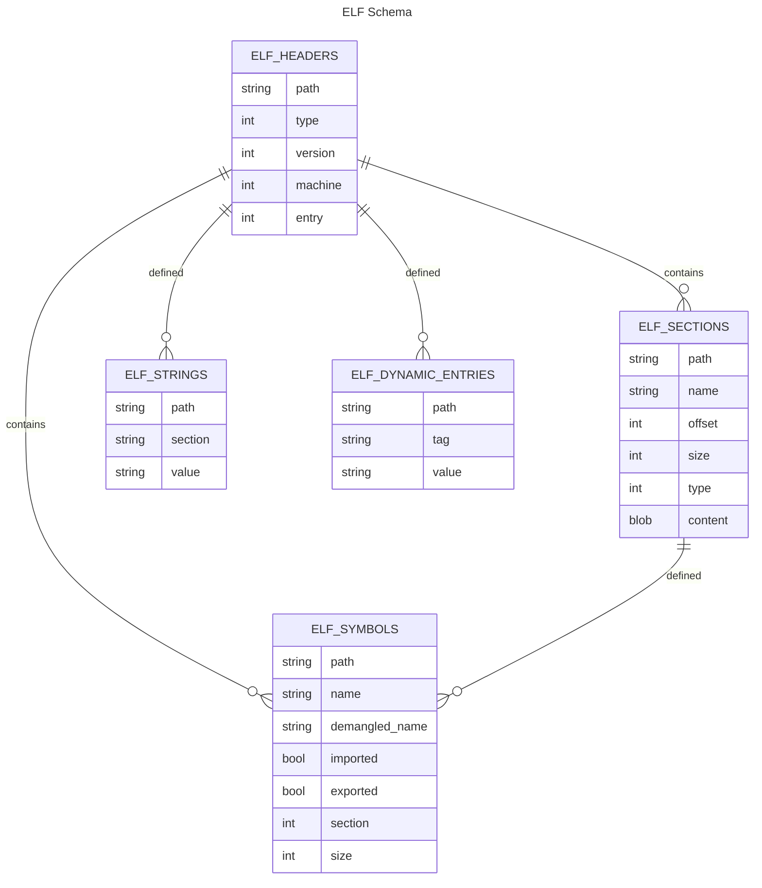

# sqlelf


A tool that utilizes SQLite's virtual table functionality to allow you to explore Linux ELF objects through SQL.

Traditionally exploring an ELF file was limited to tools such as `objdump` or `readelf`. While these tools are full featured in their parsing capability, the output format and ability to ask exploratory questions is limited.

`SQL` is the _lingua franca_ for asking questions in a declarative manner.
Let's enhance our ability to introspect binaries!



## Installation
This repository can easily be installed via source, you simply need to have [Nix or NixOS](https://nixos.org) installed.

Afterwards utilizing [devenv](https://devenv.sh/) you can enter a shell with all the dependencies provided.

```console
❯ devenv shell
Building shell ...
Entering shell ...

❯ pip install --editable .
❯ sqlelf --help
```

## Usage
```console
❯ sqlelf --help
usage: sqlelf [-h] FILE [FILE ...]

Analyze ELF files with the power of SQL

positional arguments:
  FILE        The ELF file to analyze

options:
  -h, --help  show this help message and exit
```

Note: You may provide directories for `FILE`. Avoid giving too many binaries though since they must all be parsed at startup.
## Tour

You simply have to fire up `sqlelf` and give it a list of binaries or directories and start exploring ELF via SQL.

Simple demo showing a simple `SELECT` :

```console
❯ sqlelf /usr/bin/ruby --sql "select * from elf_headers"
/usr/bin/ruby|DYNAMIC|x86_64|CURRENT|4400
```

```console
❯ sqlelf /usr/bin/ruby /bin/ls
SQLite version 3.40.1 (APSW 3.40.0.0)
Enter ".help" for instructions
Enter SQL statements terminated with a ";"
sqlite> .header ON
sqlite> select * from elf_headers;
path|type|machine|version|entry
/usr/bin/ruby|3|62|1|4400
/bin/ls|3|62|1|25040
```

A more intricate demo showing an `INNER JOIN`, `WHERE` and `GROUP BY` across two tables which each represent different portions of the ELF format.
```console
SQLite version 3.40.1 (APSW 3.40.0.0)
Enter ".help" for instructions
Enter SQL statements terminated with a ";"
sqlite> .header ON
sqlite> SELECT elf_headers.path, COUNT(*) as num_sections
    ..> FROM elf_headers
    ..> INNER JOIN elf_sections ON elf_headers.path = elf_sections.path
    ..> WHERE elf_headers.type = 3
    ..> GROUP BY elf_headers.path;
path|num_sections
/bin/ls|31
/usr/bin/pnmarith|27
/usr/bin/ruby|28
```